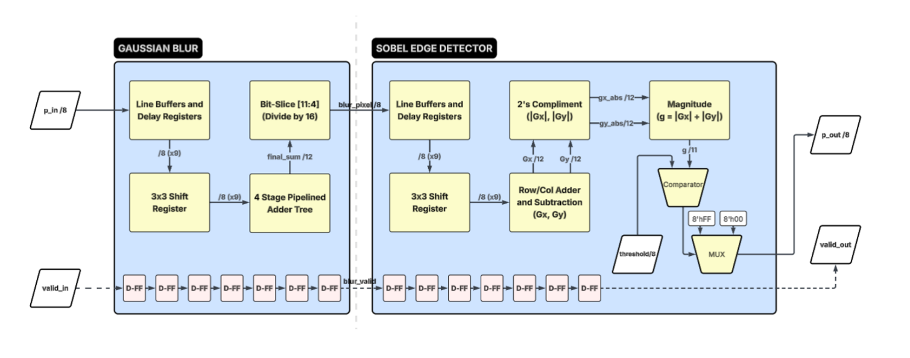

# Real-Time FPGA Edge Detection Pipeline

A fully synchronous, streaming hardware pipeline implementing a **Canny-like front end** in SystemVerilog. It processes a grayscale pixel stream using a **3×3 Gaussian blur** pre-processing stage followed by a **Sobel edge detector**, outputting a binary edge map at one pixel per clock cycle.

Synthesized and verified on **Xilinx Vivado** targeting a 7-series FPGA. Timing closure achieved at **~265 MHz** (WNS = +1.222 ns on a 5 ns / 200 MHz constraint).

---

## Features

- One pixel per clock throughput (fully pipelined, no stalls)
- 3×3 Gaussian blur for noise suppression before edge detection
- Sobel operator with L1 Norm magnitude approximation (|Gx| + |Gy|) — zero DSP slices used
- BRAM-inferred line buffers — saves hundreds of LUTs vs. distributed RAM
- Configurable 8-bit threshold for edge/non-edge classification
- Verified with synthetic tests (edge, gradient, checkerboard) and a real-world photograph

---

## Repository Structure

```
Edge-Detector/
├── src/
│   ├── edge_detector.sv       # Top-level module (wires Gaussian → Sobel)
│   ├── gaussian_blur.sv       # 3×3 Gaussian blur stage
│   ├── sobel.sv               # Sobel gradient computation + thresholding
│   ├── window_generator.sv    # 3×3 sliding window from line buffer
│   ├── line_buffer.sv         # BRAM-inferred single-line delay buffer
│   └── stream_if.sv           # Shared stream interface (pixel + valid)
├── testbench/
│   └── tb_edge_detector.sv    # Main testbench
├── scripts/
│   ├── gen_input.py           # Converts PNG → hex pixel stream for simulation
│   └── read_output.py         # Reads simulation output hex → PNG for viewing
└── data/
└── docs/
│   ├── Documentation.pdf
│   └── architecture.png 
└── .gitignore
└── README.md
└── run.bat
    
```

---

## Architecture Overview



The pipeline has two cascaded 3×3 modules. Each module uses:
- Two BRAM line buffers to maintain a 3-row sliding window
- A 3×3 shift register for the spatial neighborhood
- Explicit delay registers to compensate for BRAM read latency

> See `docs/Documentation.pdf` for the full design document, block diagram, waveforms, and design tradeoff rationale.

---

## Pipeline Latency

| Latency Type | Formula | Value (W=128) |
|---|---|---|
| Computational (Lc) | 7 (Gaussian) + 7 (Sobel) | **14 clock cycles** |
| Spatial (Ls) | 4W + Lc | **526 clock cycles** |

The first valid output pixel appears 526 clock cycles after the first input pixel for a 128-pixel-wide image.

---

## Output Resolution

The design uses a **crop-not-pad** border strategy. Each 3×3 module removes a 1-pixel border on all sides:

| Stage | Resolution |
|---|---|
| Input | 128 × 128 |
| After Gaussian | 126 × 126 |
| After Sobel | **124 × 124** |

---

## Resource Utilization (Xilinx Vivado Synthesis)

| Resource | Count | Notes |
|---|---|---|
| Slice LUTs | 237 | Adder trees, 2's complement, comparator |
| Flip-Flops | 449 | Sliding window registers + pipeline stages |
| BRAM Tiles | 2 | 4 logical line buffers packed into 2 physical tiles |
| DSP Slices | **0** | L1 Norm replaces square root — no multipliers needed |
| Max Frequency | **~265 MHz** | WNS = +1.222 ns on a 200 MHz (5 ns) constraint |

---

## How to Use

### Prerequisites

- **Simulator:** Verilator (v5.0 or later recommended with --timing support enabled)
- **Python 3** with `opencv-python` and `numpy` (for image conversion scripts)
  ```bash
  pip install opencv-python numpy
  ```

### Step 1 — Prepare Input Images (optional, hex files already included)

To convert your own PNG to a simulation hex stream:
```bash
python scripts/gen_input.py data/your_image.png --out_dir data/hex --size 128
```
The script resizes, converts to greyscale, and writes one byte per line as hex.

### Step 2 — Run Simulation

**Verilator:**
```bat
echo === Compiling SystemVerilog Design ===
for /f "delims=" %%i in ('wsl wslpath -a "%CD%"') do set WSL_PATH=%%i
wsl bash -c "cd '%WSL_PATH%' && verilator --binary --timing -Wall -Wno-fatal -sv src/stream_if.sv src/window_generator.sv src/line_buffer.sv src/gaussian_blur.sv src/sobel.sv src/edge_detector.sv testbench/tb_edge_detector.sv --top-module tb_edge_detector"
if %errorlevel% neq 0 exit /b %errorlevel%

echo === Running Hardware Simulation ===
wsl bash -c "cd '%WSL_PATH%' && ./obj_dir/Vtb_edge_detector"
if %errorlevel% neq 0 exit /b %errorlevel%
```

The testbench reads from `data/hex/ip_img*.hex` and writes output hex files to the working directory.

### Step 3 — View Output Images

```bash
python scripts/read_output.py --in_file output_image.hex --out_file result1.png --size 124
```
Output images are 124×124 pixels (128 − 4 for border cropping across both stages).

### Step 4 — Adjust the Threshold

The edge threshold is an 8-bit parameter on the top-level module. In `testbench/tb_edge_detector.sv`, find:
```systemverilog
.threshold(8'h80)   // Adjust this value (0–255)
```
A lower threshold detects weaker edges; a higher threshold only detects sharp transitions.

---

## Adding Your Own Image

1. Run `gen_input.py` pointing at any PNG — it resizes, converts to greyscale, and auto-generates the config:
   ```bash
   python scripts/gen_input.py data/your_image.png --out_dir data/hex --size 128
   ```
2. Recompile and simulate. The python script automatically resizes your custom image to 128×128 to match the fixed hardware grid.
3. Run `read_output.py` to convert the output hex back to a viewable PNG.

---

## Design Tradeoffs

These are the key architectural decisions made and the reasoning behind each.

### 1. Line Buffer Memory: BRAM vs. Distributed RAM
**Tradeoff: Area vs. Latency**

Distributed RAM uses the FPGA's general-purpose LUT slices to implement delay lines, which would consume hundreds of logic cells just to buffer pixel rows — logic that could otherwise be used for routing and arithmetic. By designing the line buffers with explicit read/write pointers, the synthesis tool infers Block RAM (BRAM), leveraging dedicated on-chip SRAM instead.

The cost is a mandatory 1-clock BRAM read latency, which required additional alignment registers (`p_in_d2`, `lb1_out_d1`) to keep the 3-row window correctly synchronized. This was judged a worthwhile tradeoff: LUT utilization stays extremely low and power consumption is reduced.

### 2. Border Handling: Crop vs. Zero-Padding
**Tradeoff: Logic Complexity vs. Output Resolution**

Zero-padding requires tracking pixel coordinates dynamically and multiplexing `8'h00` into the datapath whenever the 3×3 window crosses an image boundary. This bloats the critical path and reduces the maximum achievable clock frequency.

Instead, the pipeline simply crops — invalid border pixels are dropped as the window slides off the edge. The 128×128 input shrinks to 124×124 output (2 pixels per edge removed by each of the two 3×3 stages). This removes all multiplexer logic from the critical path and keeps throughput at its maximum.

### 3. Cascaded 3×3 vs. Monolithic 5×5 Kernel
**Tradeoff: Pipeline Depth vs. Combinational Delay**

Mathematically, a 3×3 Gaussian followed by a 3×3 Sobel is equivalent to a single pre-computed 5×5 convolution. Both approaches require four line buffers. However, a monolithic 5×5 filter needs a combinational adder tree summing 25 pixels in one stage — a massive propagation delay that would set the critical path and limit clock speed.

Cascading two separate 3×3 modules keeps the combinational logic between registers short, allowing the FPGA to achieve a significantly higher maximum clock frequency at the cost of deeper pipeline latency (14 cycles vs. ~7 for a single stage).

### 4. Magnitude Approximation: L1 Norm vs. True Euclidean
**Tradeoff: Area vs. Precision**

The true Sobel magnitude is `√(Gx² + Gy²)`, which requires two multipliers (DSP slices) and multi-cycle square root logic. By using the Manhattan distance approximation `|G| = |Gx| + |Gy|` instead, the design eliminates all DSP usage — replaced by a single lightweight adder. The result is **0 DSP slices** consumed, freeing the FPGA's dedicated multiplier blocks entirely for other system tasks. The approximation introduces a maximum ~12% magnitude overestimate in the worst case (45° edges), which is imperceptible after thresholding.

---

## License

MIT
